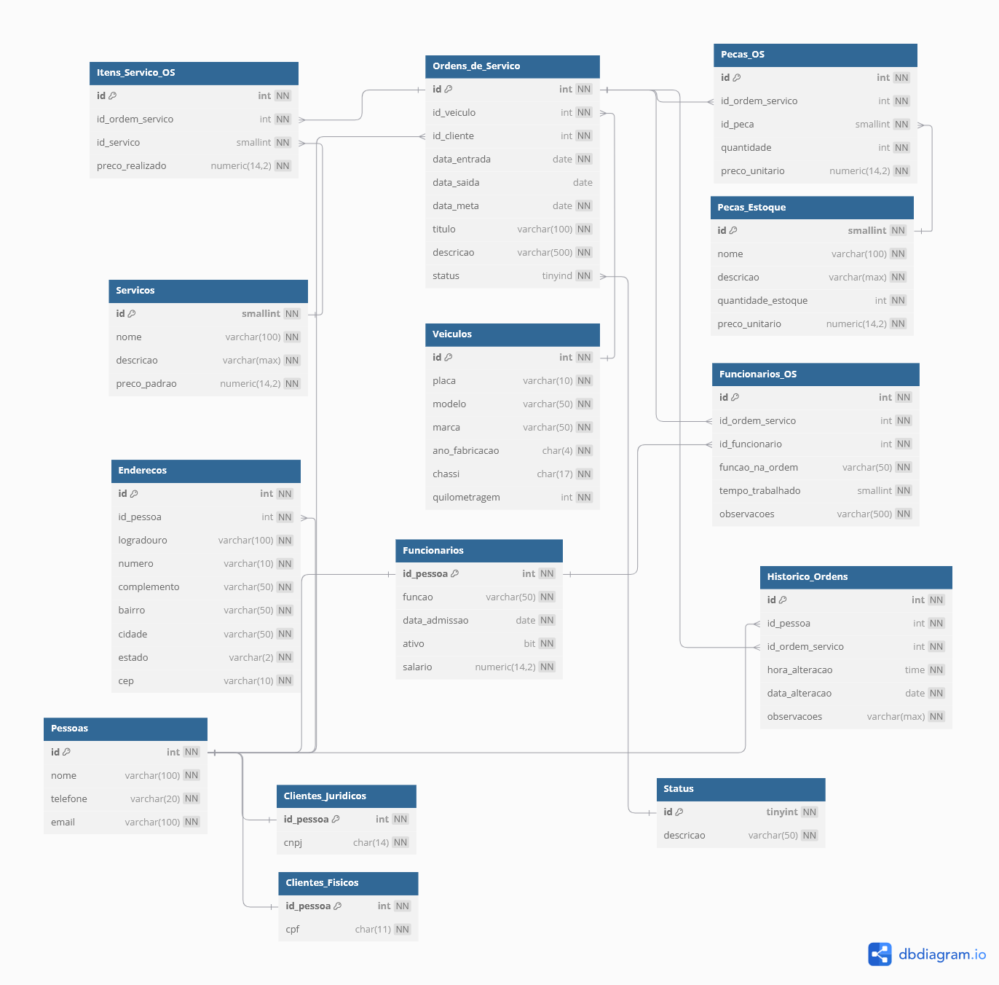

## Projeto Sistema de Manutenção de Veiculos - GRUPO B

Este projeto consiste na criação de um modelo físico de um banco de dados para um sistema de manutenção de veiculos.
O projeto foi desenvolvido em PHP, criando um CRUD para cadastro de veículos, onde a aplicacao faz conexão com o banco de dados através de uma biblioteca chamada **XXXX** e realiza operações de adição, aualização e deleção dos dados, usando todos os conceitos e dinâmicas práticas de SQL desenvolvidas em aula.

### Integrantes
Calebe Arlan Souza da Silva - CalebeArlan<br>
Caio dos Santos Lopes - caiolopesxd<br>
Gustavo Gonçalves dos Santos - Xav86<br>
Lucas Pizoni Flores - LuxLucas<br>
Matheus Araújo de Melo - AqueleQueSemeiaOConhecimento


### Modelo Físico
Utilizamos a ferramenta de modelagem de dados [dbdiagram.io](https://dbdiagram.io/) para criação do modelo físico do banco de dados, para posterior exportação dos scripts DDL das tabelas e relacionamentos.<br>
Arquivo fonte: [Modelo Fisico](https://dbdiagram.io/d/683653e36980ade2ebc12adc).<br>



---

## em produção
  
### Dicionário de Dados
As informações sobre as tabelas e índices foram documentados na planilha [template1.xlsx](dicionario_dados/template1.xlsx).

### Scripts SQL
Para este projeto foi utilizado o banco de dados [Azure SQL](https://azure.microsoft.com/pt-br/products/azure-sql/database) <br>
Este é o procedimento para criação do banco de dados Azure SQL [Criando SQL Azure serverless no Azure gratuito - Sem cartão de crédito](https://github.com/jlsilva01/sql-azure-satc).

Abaixo, segue os scripts SQL separados por tipo:
+ [Tabelas](scripts/ddl/tabelas)
+ [Índices](scripts/ddl/indices)
+ [Gatilhos](scripts/ddl/gatilhos)
+ [Procedimentos armazenados](scripts/ddl/procedimentos-armazenados)
+ [Funções](scripts/ddl/funcoes)
+ [DML](scripts/dml)

### Código Fonte do CRUD
- Linguagem de Programação PHP<br>
- HTML
- CSS
- JS
- Bootstrap
- SQL Server

### Passos para execução do CRUD

1. Criar banco de dados e alimentar
```
2. Fazer conexão com o arquivo  db.php do crud
   

[Codigo Fonte](crud/)

### Relatório Final
O relatório final está disponível no arquivo [relatorio-final/template1.docx](relatorio/template1.docx).

### Bibliografia
CORREIOS. **ENDEREÇAMENTO DE ENCOMENDAS GUIA TÉCNICO**. [s.l: s.n.]. Disponível em: <https://www.correios.com.br/enviar/encomendas/arquivo/nacional/guia-de-enderecamento.pdf>. Acesso em: 21 jun. 2025.

DIZ, J. **Índice de cobertura (covering index)**. Disponível em: <https://portosql.wordpress.com/2020/07/10/indice-de-cobertura/>. Acesso em: 23 jun. 2025. 

IURICODE. **GitHub - iuricode/padroes-de-commits: Padrões de commits**. Disponível em: <https://github.com/iuricode/padroes-de-commits>. 

MARKINGMYNAME. **DATEPART (Transact-SQL) - SQL Server**. Disponível em: <https://learn.microsoft.com/pt-br/sql/t-sql/functions/datepart-transact-sql?view=sql-server-ver16>. Acesso em: 22 jun. 2025. 

MIKERAYMSFT. **int, bigint, smallint e tinyint (Transact-SQL) - SQL Server**. Disponível em: <https://learn.microsoft.com/pt-br/sql/t-sql/data-types/int-bigint-smallint-and-tinyint-transact-sql?view=sql-server-ver17>. Acesso em: 23 jun. 2025. 

MIKERAYMSFT. **decimal e numeric (Transact-SQL) - SQL Server**. Disponível em: <https://learn.microsoft.com/pt-br/sql/t-sql/data-types/decimal-and-numeric-transact-sql?view=sql-server-ver16>. Acesso em: 23 jun. 2025. 

MIKERAYMSFT. **char e varchar (Transact-SQL) - SQL Server**. Disponível em: <https://learn.microsoft.com/pt-br/sql/t-sql/data-types/char-and-varchar-transact-sql?view=sql-server-ver17>. 

SANTANA, L. **Generalização e Especialização na Modelagem de Dados**. Disponível em: <https://consultabd.wordpress.com/2020/07/24/generalizacao-e-especializacao-na-modelagem-de-dados/>. Acesso em: 21 jun. 2025. 

W3SCHOOL. **Tipos de dados SQL para MySQL, SQL Server e MS Access**. Disponível em: <https://www-w3schools-com.translate.goog/sql/sql_datatypes.asp?_x_tr_sl=en&_x_tr_tl=pt&_x_tr_hl=pt&_x_tr_pto=tc>. Acesso em: 21 jun. 2025. 
