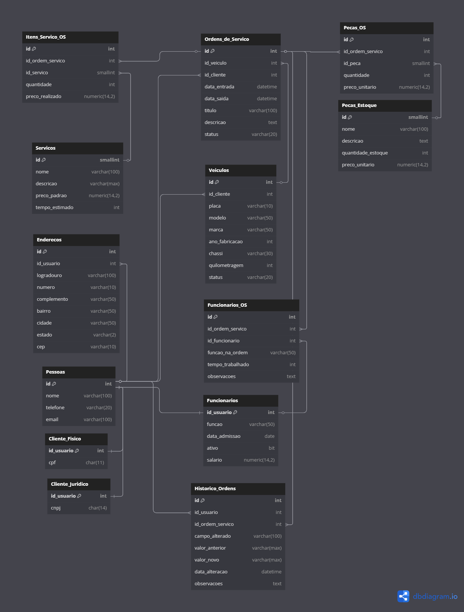

## Projeto Sistema de Manutenção de Veiculos - GRUPO B

Este projeto consiste na criação de um modelo físico de um banco de dados para um sistema de manutenção de veiculos.
O projeto foi desenvolvido em PHP, criando um CRUD para cadastro dos itens **XXXX**, onde a aplicacao faz conexão com o banco de dados através de uma biblioteca chamada **XXXX** e realiza operações de adição, aualização e deleção dos dados, usando todos os conceitos e dinâmicas práticas de SQL desenvolvidas em aula.

### Integrantes
Calebe Arlan Souza da Silva - CalebeArlan<br>
Caio dos Santos Lopes - caiolopesxd<br>
Gustavo Gonçalves dos Santos - Xav86<br>
Lucas Pizoni Flores - LuxLucas<br>
Matheus Araújo de Melo - AqueleQueSemeiaOConhecimento


### Modelo Físico
Utilizamos a ferramenta de modelagem de dados [dbdiagram.io](https://dbdiagram.io/) para criação do modelo físico do banco de dados, para posterior exportação dos scripts DDL das tabelas e relacionamentos.<br>
Arquivo fonte: [Modelo Fisico](https://dbdiagram.io/d/683653e36980ade2ebc12adc).<br>



---

## em produção
  
### Dicionário de Dados
As informações sobre as tabelas e índices foram documentados na planilha [template1.xlsx](dicionario_dados/template1.xlsx).

### Scripts SQL
Para este projeto foi utilizado o banco de dados [Azure SQL](https://azure.microsoft.com/pt-br/products/azure-sql/database) <br>
Este é o procedimento para criação do banco de dados Azure SQL [Criando SQL Azure serverless no Azure gratuito - Sem cartão de crédito](https://github.com/jlsilva01/sql-azure-satc).

Abaixo, segue os scripts SQL separados por tipo:
+ [Tabelas](scripts/ddl/tabelas)
+ [Índices](scripts/ddl/indices)
+ [Gatilhos](scripts/ddl/gatilhos)
+ [Procedimentos armazenados](scripts/ddl/procedimentos-armazenados)
+ [Funções](scripts/ddl/funcoes)
+ [DML](scripts/dml)

### Código Fonte do CRUD
- Linguagem de Programação C# .NET.<br>
- Framework .NET 4.6
- Projeto Windows Forms
- Biblioteca Entity Framework para SQL Server (nativo)

### Passos para execução do CRUD

1. Criar banco de dados pelo docker.
```
docker run xyz
```
2. ...
   

[Codigo Fonte](crud/)

### Relatório Final
O relatório final está disponível no arquivo [relatorio-final/template1.docx](relatorio/template1.docx).
